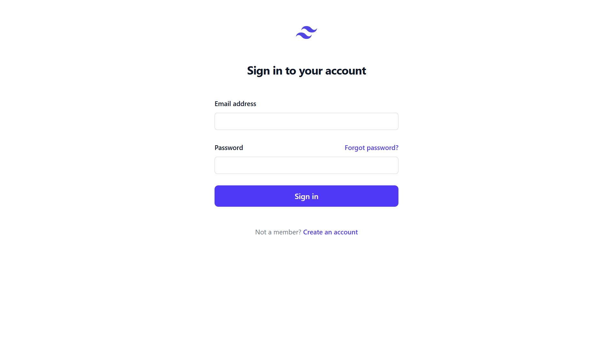
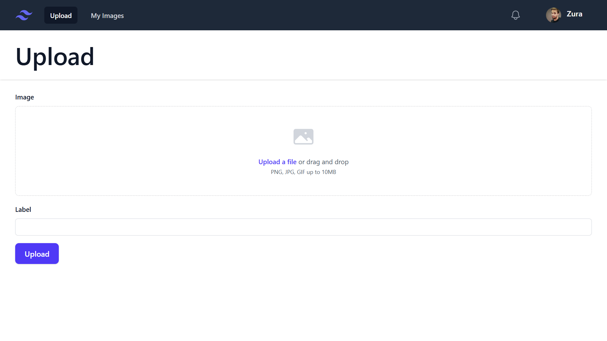
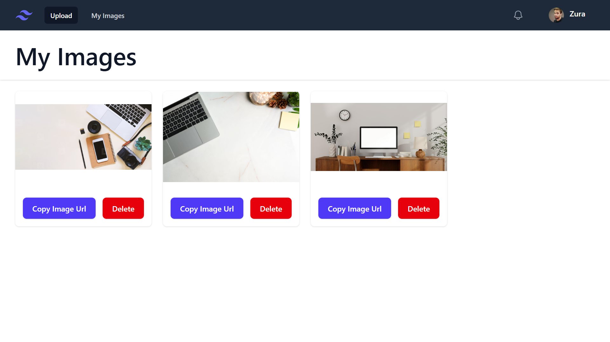

# Vue-Laravel Full Stack Image Management App

A full-stack web application built with Vue 3 (Vite) and Laravel API.
The app supports authentication, image upload, labeling, and image management.

---

## 🚀 Tech Stack

- Frontend: Vue 3 + Vite
- Backend: Laravel 10 API
- Authentication: Laravel Sanctum
- Database: MySQL (XAMPP)
- Server: Apache (XAMPP)
- Styling: Tailwind CSS

---

## 📸 Screenshots

### 🔐 Login Page


### ⬆ Upload Page


### 🖼 Image Management Page


---

## ✨ Features

- User authentication (Login / Logout)
- Protected routes
- Image upload with label
- Image preview & gallery layout
- Delete image functionality
- RESTful API integration

---

## 🛠 Local Development Setup

Due to hosting limitations, the live demo is not currently deployed.

To run locally:

```bash
# Clone repository
git clone https://github.com/ThnthrP/Vue-Laravel-API-Full-Stack-App.git


# Backend setup
cd backend
composer install
cp .env.example .env
php artisan key:generate
php artisan migrate
php artisan serve

# Frontend setup
cd frontend
npm install
npm run dev
